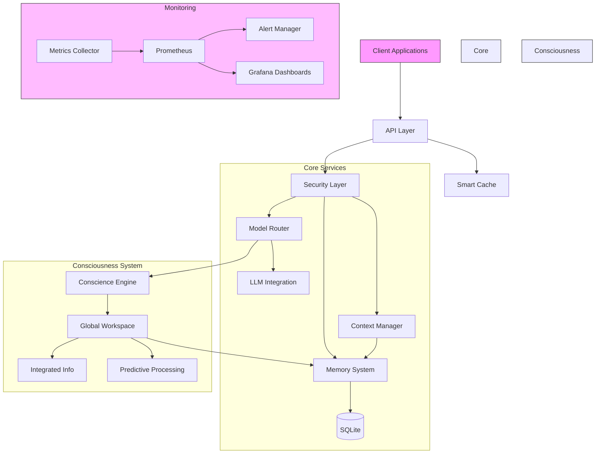
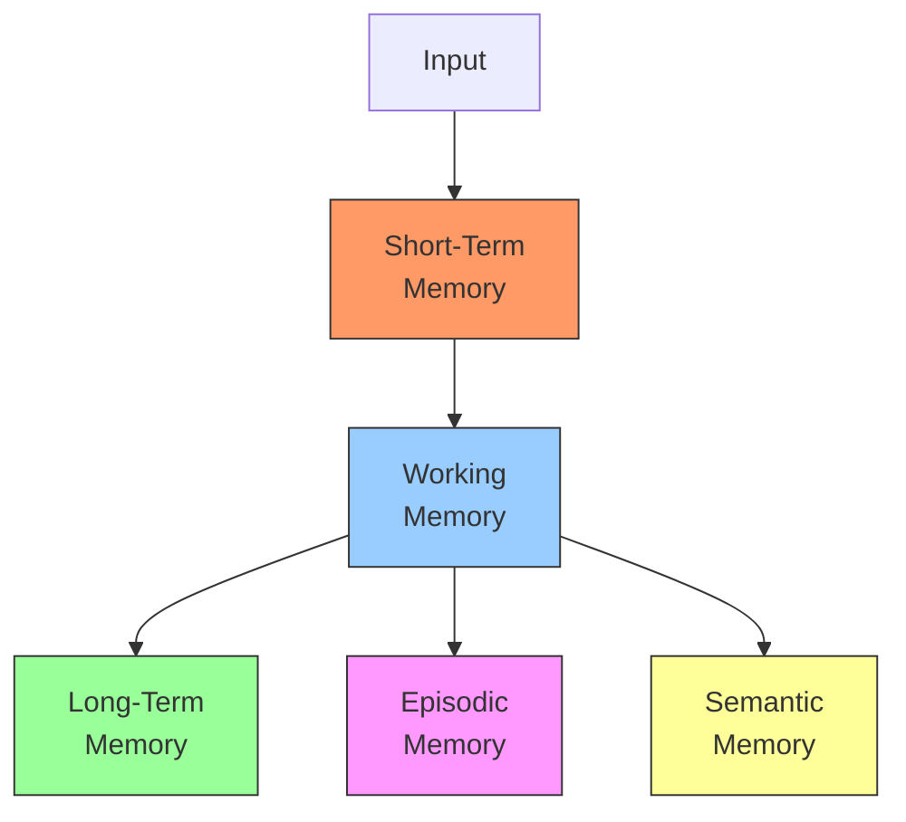
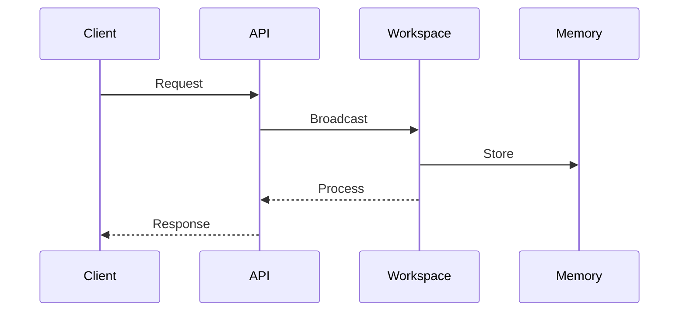
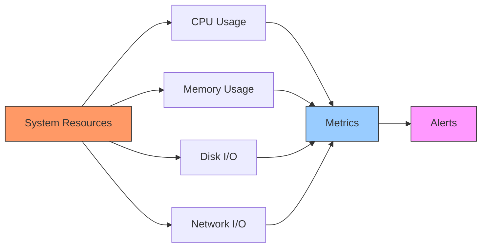
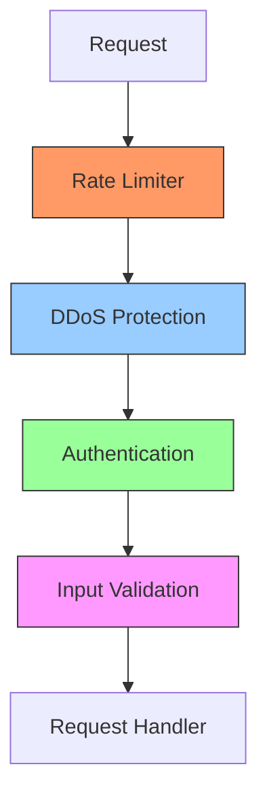

# Performance Guidelines and Architecture

This document outlines performance best practices and system architecture for Jamey 3.0.

## System Architecture



## Performance Guidelines

### 1. Caching Strategy

#### Multi-Level Cache


#### Implementation Guidelines
```rust
// Configure cache tiers appropriately
let cache_config = CacheConfig {
    max_capacity: 10_000,
    time_to_live: Duration::from_secs(3600),
    time_to_idle: Duration::from_secs(1800),
};

// Use appropriate cache type for data
cache.insert(CacheType::Response, key, value).await?;
cache.insert(CacheType::Embedding, key, value).await?;
cache.insert(CacheType::Persistent, key, value).await?;
```

### 2. Memory Management

#### Memory System Architecture


#### Best Practices
```rust
// Configure appropriate retention periods
let config = MemoryConfig {
    short_term_ttl: Duration::from_secs(300),    // 5 minutes
    working_memory_size: 100,                    // Items
    long_term_pruning: Duration::from_days(30),  // 30 days
};

// Use appropriate memory layer
memory_system.store(MemoryLayer::ShortTerm, content).await?;
memory_system.store_with_provider(
    MemoryLayer::LongTerm,
    content,
    Some("entity_id"),
    Some("preferred_model")
).await?;
```

### 3. Async Communication

#### Communication Flow


#### Implementation Guidelines
```rust
// Configure channel bounds
let channel_config = ChannelConfig {
    capacity: 1000,
    retry_config: RetryConfig {
        initial_delay: Duration::from_millis(50),
        max_delay: Duration::from_millis(500),
        max_retries: 3,
        backoff_factor: 2.0,
    },
};

// Use bounded channels with backpressure
let message = Message::new(content, Priority::Normal);
channel.send(message).await?;
```

### 4. Resource Management

#### Resource Monitoring


#### Implementation
```rust
// Record resource metrics
metrics::gauge!("system_memory_bytes", memory_bytes as f64);
metrics::gauge!("system_disk_free_bytes", disk_free_bytes as f64);
metrics::gauge!("system_cpu_usage", cpu_usage as f64);

// Configure alerts
alerts! {
    name: "HighMemoryUsage",
    expr: "memory_usage > 85%",
    for: "5m",
    labels: {severity: "warning"}
}
```

### 5. Database Optimization

#### Query Optimization
- Use prepared statements
- Implement connection pooling
- Configure appropriate indices
- Regular VACUUM operations

```rust
// Use connection pool
let pool = SqlitePool::connect_with(
    SqliteConnectOptions::new()
        .filename("data.db")
        .create_if_missing(true)
        .journal_mode(SqliteJournalMode::Wal)
        .synchronous(SqliteSynchronous::Normal)
        .busy_timeout(Duration::from_secs(30))
).await?;

// Use prepared statements
let stmt = sqlx::query!(
    "SELECT * FROM memories WHERE layer = ? AND timestamp > ?",
    layer,
    cutoff
);
```

### 6. Security Performance

#### Security Layer Architecture


#### Implementation
```rust
// Configure rate limiting
let config = RateLimitConfig {
    requests_per_second: 10,
    burst_size: 50,
};

// Apply security middleware
let app = Router::new()
    .layer(RateLimitLayer::new(config))
    .layer(DdosProtectionLayer::new())
    .layer(AuthenticationLayer::new())
    .layer(ValidationLayer::new());
```

## Performance Monitoring

### 1. Metrics Collection
- Request latencies
- Cache hit rates
- Memory usage
- System resources
- Business metrics

### 2. Alerting Rules
- Resource constraints
- Performance degradation
- Error rates
- Security incidents

### 3. Dashboard Organization
- System overview
- Performance metrics
- Error tracking
- Resource utilization
- Business insights

## Performance Checklist

### Development
- [ ] Implement appropriate caching
- [ ] Use connection pooling
- [ ] Configure async bounds
- [ ] Implement rate limiting
- [ ] Set up monitoring

### Deployment
- [ ] Configure resource limits
- [ ] Set up alerts
- [ ] Enable metrics collection
- [ ] Configure logging
- [ ] Set up dashboards

### Maintenance
- [ ] Monitor metrics
- [ ] Review alerts
- [ ] Optimize queries
- [ ] Update indices
- [ ] Prune old data