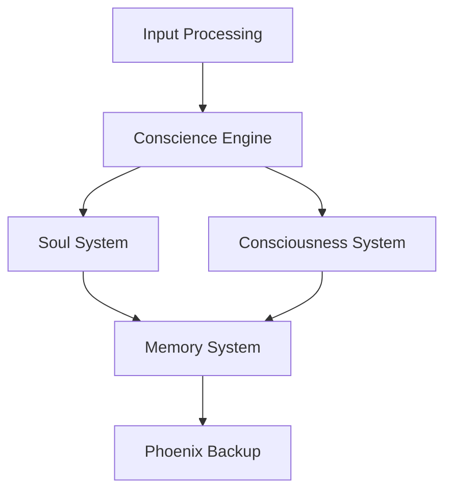

# Jamey 3.0 System Architecture

## System Overview

Jamey 3.0 is a sophisticated system built around several core subsystems that work together to create an intelligent, emotionally-aware agent. The architecture emphasizes security, reliability, and maintainability through clear separation of concerns and robust monitoring.

## Core Subsystems

### 1. Soul System
- **Purpose**: Manages emotional states and trust relationships
- **Key Components**:
  - Emotion tracking and processing
  - Trust calculation and decay
  - Entity relationship management
  - Empathy scoring system
- **Integration Points**: Interfaces with Conscience system for moral evaluation

### 2. Conscience Engine
- **Purpose**: Evaluates actions against moral rules
- **Key Features**:
  - Rule-based moral evaluation
  - Weighted scoring system
  - Soul KB integration for emotional context
  - Default moral rules with customizable weights

### 3. Memory System
- **Purpose**: Multi-layered memory management
- **Components**:
  - Short-term memory with Tantivy indexing
  - Long-term memory storage
  - Working memory cache
  - Memory optimization system
- **Features**:
  - Automatic memory pruning
  - Performance optimization
  - Cache management

### 4. Phoenix Backup System
- **Purpose**: Secure backup and recovery
- **Features**:
  - AES-256-GCM encryption
  - Scheduled backups
  - Multi-component backup (DB, memory indices, config)
  - Secure recovery procedures

## Data Architecture

### Database Schema
1. **Core Tables**:
   - `app_metadata`: System versioning and initialization
   - `soul_entities`: Entity tracking and trust scores
   - `soul_emotions`: Emotional state records
   - `memory_records`: Memory storage and retrieval

2. **Consciousness System**:
   - `consciousness_metrics`: System performance tracking
   - `consciousness_state`: State management
   - `identity_matrices`: Role and strength tracking
   - `mission_objectives`: System goals and priorities

### Data Flow

## Security Architecture

### Multi-layered Security
1. **API Security**:
   - API key authentication
   - Rate limiting (token bucket algorithm)
   - Input validation
   - CORS protection

2. **Data Security**:
   - AES-256-GCM encryption for backups
   - Secure key management
   - Access control system
   - Audit logging

3. **Network Security**:
   - TLS/mTLS support
   - MQTT security features
   - Secure websocket connections
   - Network isolation capabilities

## Monitoring and Observability

### Metrics Collection
1. **System Metrics**:
   - CPU and memory usage
   - Request latency
   - Error rates
   - Cache performance

2. **Business Metrics**:
   - Consciousness Φ value
   - Emotional stability
   - Memory system performance
   - Trust calculations

### Alerting System
- Critical consciousness state alerts
- System availability monitoring
- Performance degradation warnings
- Security incident detection

## Operational Architecture

### Configuration Management
- Environment-based configuration
- Strict validation rules
- Secure secret management
- Feature toggles

### High Availability Features
- Automatic backup scheduling
- Failure detection and recovery
- State persistence
- Data integrity checks

## Technical Decisions

### 1. Language Choice: Rust
- Memory safety
- Performance characteristics
- Strong type system
- Excellent concurrency support

### 2. Storage Decisions
- SQLite for structured data
- Tantivy for search indices
- File-based backup storage
- In-memory caching

### 3. Communication Patterns
- MQTT for real-time events
- HTTP API for external integration
- Websockets for streaming
- Internal message passing

## System Requirements

### Hardware Requirements
- Minimum 4GB RAM
- 2 CPU cores
- 20GB storage
- Network connectivity

### Software Requirements
- Linux/Windows/MacOS support
- SQLite 3.x
- OpenSSL for cryptography
- System service capability

## Deployment Architecture

### Container Support
- Docker configuration
- Volume management
- Network isolation
- Resource limits

### Service Management
- Systemd service definitions
- Automatic startup
- Failure recovery
- Log rotation

## Future Considerations

### Scalability
- Horizontal scaling capability
- Load balancing preparation
- Database scaling options
- Caching improvements

### Extensibility
- Plugin architecture
- API versioning
- Configuration flexibility
- Module independence
