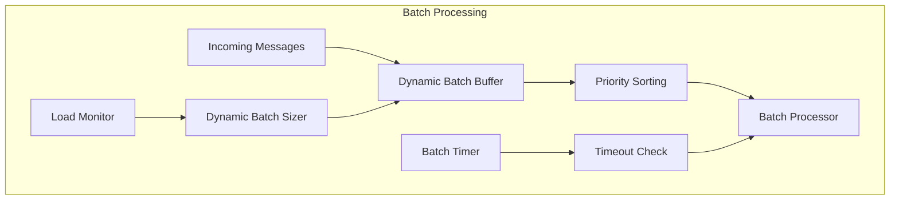
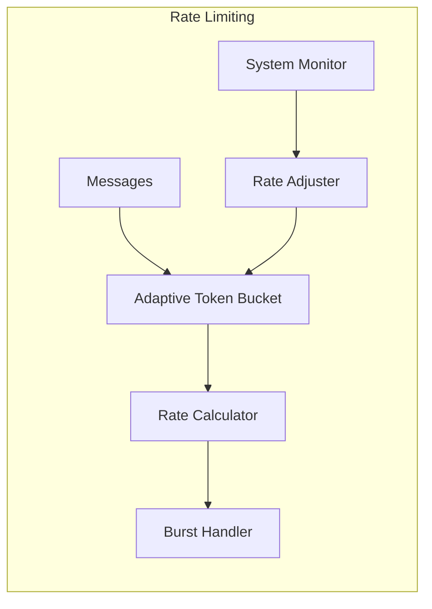
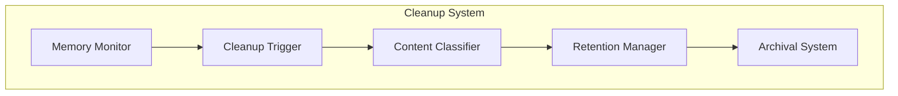
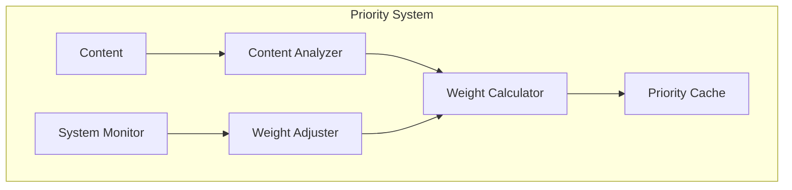
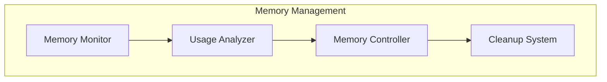

# Global Workspace System Optimizations

## 1. Batch Processing System

### Current Limitations
- Fixed batch size of 10 messages
- No timeout mechanism for partially filled batches
- Simple FIFO batch processing without priority consideration
- No handling of burst scenarios

### Optimized Design

#### Dynamic Batch Sizing
- Base batch size: 10 messages (configurable)
- Scaling factors:
  - System load: 0.5x to 2x multiplier
  - Memory pressure: 0.7x to 1.5x multiplier
  - Queue length: 1x to 3x multiplier
- Maximum batch size: 50 messages
- Minimum batch size: 5 messages

#### Batch Timeout Handling
- Base timeout: 100ms
- Dynamic timeout adjustment:
  - High load: -50% (faster processing)
  - Low load: +100% (better batching)
- Force process on:
  - High priority message (priority > 0.8)
  - Timeout reached
  - Maximum batch size reached

#### Batch Prioritization
- Priority-based sorting within batches
- Priority boost factors:
  - Age in queue: +0.1 per second
  - System state: +0.2 for critical states
  - Content type: +0.1-0.3 based on urgency

## 2. Rate Limiting System

### Current Limitations
- Fixed rate limit of 100 messages/second
- No burst handling
- No priority consideration
- Basic token bucket implementation

### Optimized Design

#### Adaptive Rate Limiting
- Base rate: 100 messages/second
- Burst capacity: 200 messages
- Recovery rate: 10 tokens/100ms

#### Dynamic Thresholds
- Normal operation: 100 msg/s
- Burst allowance: Up to 300 msg/s for 2s
- Low load: Up to 150 msg/s
- High load: Down to 50 msg/s
- Critical load: Down to 20 msg/s

#### Priority-Based Rate Limiting
- Priority multipliers:
  - High (>0.8): 2x rate limit
  - Medium (0.5-0.8): 1x rate limit
  - Low (<0.5): 0.5x rate limit

## 3. Broadcast Cleanup Strategy

### Current Limitations
- Fixed cleanup age of 300 seconds
- No priority consideration
- Basic cleanup without archival
- Single-tier retention

### Optimized Design

#### Tiered Retention Policy
1. Critical Tier (priority >= 0.9)
   - Retention: 24 hours
   - Archive: Yes
   - Compression: No

2. Important Tier (priority 0.7-0.9)
   - Retention: 6 hours
   - Archive: Yes
   - Compression: After 1 hour

3. Standard Tier (priority 0.4-0.7)
   - Retention: 1 hour
   - Archive: No
   - Compression: After 15 minutes

4. Low Priority Tier (priority < 0.4)
   - Retention: 15 minutes
   - Archive: No
   - Immediate compression

#### Cleanup Triggers
- Memory threshold: 80% usage
- Age threshold: Tiered based on priority
- System load: > 70% triggers aggressive cleanup
- Manual trigger capability

#### Archive Strategy
- Format: MessagePack with zstd compression
- Location: Separate archive storage
- Index: Priority-based fast retrieval
- Retention: 30 days for critical/important

## 4. Priority Calculation System

### Current Limitations
- Fixed weight factors
- Basic caching with fixed timeout
- Limited factor consideration
- No adaptive adjustment

### Optimized Design

#### Multi-Factor Priority Algorithm
Base factors (dynamic weights):
- Length (0.1-0.3)
- Complexity (0.2-0.4)
- Novelty (0.1-0.3)
- Urgency (0.2-0.4)

Additional factors:
- Historical importance (0.1-0.2)
- System state correlation (0.1-0.3)
- Content type weight (0.1-0.2)

#### Priority Bounds
- Minimum: 0.1
- Maximum: 1.0
- Default: 0.5
- Boost cap: +0.3
- Penalty cap: -0.2

#### Caching Mechanism
- Cache size: 1000 entries
- TTL: Dynamic based on priority
  - High priority: 30s
  - Medium priority: 60s
  - Low priority: 120s
- Cache eviction: LRU with priority weighting

## 5. Memory Management System

### Memory Tracking

#### Memory Thresholds
- Warning: 70% usage
- Critical: 85% usage
- Emergency: 95% usage

#### Cleanup Triggers
1. Threshold-based
   - Warning: Soft cleanup
   - Critical: Aggressive cleanup
   - Emergency: Forced cleanup

2. Time-based
   - Regular: Every 5 minutes
   - Deep: Every hour

#### Metrics Collection
- Memory usage per component
- Allocation rates
- Cleanup effectiveness
- Cache hit rates
- Broadcast sizes
- Queue lengths

## Implementation Priority

1. Batch Processing System
2. Priority Calculation System
3. Rate Limiting System
4. Memory Management System
5. Broadcast Cleanup Strategy

## Success Metrics

1. Performance
   - 50% reduction in broadcast latency
   - 30% improvement in memory efficiency
   - 40% reduction in cleanup overhead

2. Reliability
   - 99.99% broadcast success rate
   - Zero memory-related crashes
   - < 1% priority calculation errors

3. Scalability
   - Support 3x current load
   - Linear scaling up to 1000 msg/s
   - < 100ms p99 latency