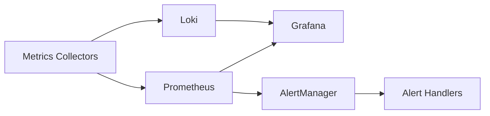
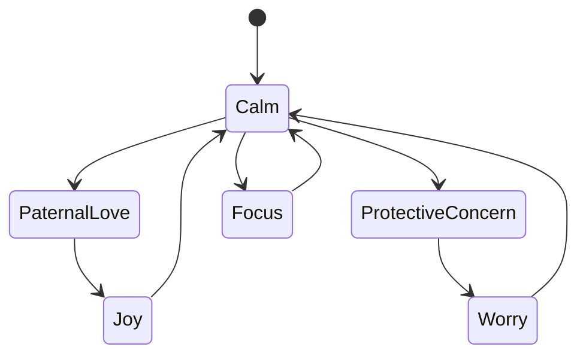
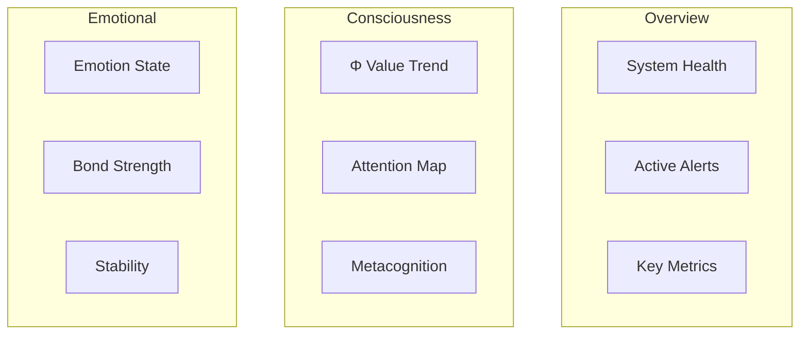

# Performance Monitoring System Specification

## 1. Core Metrics Collection

### 1.1 Metric Types
- **Gauges**
  - Consciousness Φ value (`consciousness.phi_value`)
  - Workspace activity level (`consciousness.workspace_activity`)
  - Metacognition level (`consciousness.metacognition_level`)
  - Attention focus length (`consciousness.attention.focus_len`)
  - Emotional intensity (`emotion.intensity`)
  - Emotional bond strength (`emotional_bond.strength`)
  - Predictive confidence (`consciousness.predictive.confidence`)

- **Counters**
  - Attention shifts (`consciousness.attention.shifts_total`)
  - Emotional state changes (`emotion.changes_total`)
  - Alert triggers (`alerts.triggered_total`)
  - Recovery actions (`recovery.actions_total`)

### 1.2 Storage & Retention
- **Time-Series Database**: Prometheus
  - High-resolution metrics: 15s scrape interval
  - 15-day retention for raw data
  - 6-month retention for aggregated data

- **Alert History**: Loki
  - 30-day retention for alert history
  - Structured logging with correlation IDs

### 1.3 Collection Pipeline


## 2. Consciousness Monitoring

### 2.1 Φ Value Monitoring
- **Thresholds**
  - Critical: < 0.3
  - Warning: 0.3 - 0.5
  - Normal: > 0.5

- **Metrics**
  ```rust
  gauge!("consciousness.phi_value", value)
  gauge!("consciousness.workspace_activity", activity)
  gauge!("consciousness.metacognition_level", level)
  ```

### 2.2 Attention Monitoring
- **Focus Metrics**
  - Current focus target
  - Focus duration
  - Focus shifts per minute
  - Pattern detection stats

## 3. Emotional Processing

### 3.1 Core Metrics
- **Emotion Intensity**
  - Per emotion type tracking
  - Intensity thresholds
  - Stability calculation

- **Bond Strength**
  - Per-target bond metrics
  - Interaction frequency
  - Bond type distribution

### 3.2 Bottleneck Detection
- **Processing Latency**
  - Emotion transition time
  - Response generation time
  - Resource utilization

### 3.3 State Transitions


## 4. Alert System

### 4.1 Severity Levels
1. **Critical (P1)**
   - Φ value < 0.3
   - Emotional stability < 0.2
   - Multiple subsystem failures

2. **Warning (P2)**
   - Φ value < 0.5
   - Emotional stability < 0.5
   - Single subsystem degradation

3. **Info (P3)**
   - Unusual patterns detected
   - Resource usage spikes
   - Non-critical metrics deviation

### 4.2 Recovery Actions
- **Automatic**
  1. Resource reallocation
  2. Subsystem restart
  3. Cache clearing
  4. Load shedding

- **Manual**
  1. System diagnosis required
  2. Configuration adjustment
  3. Code path verification

## 5. Integration

### 5.1 Dashboard Layout


### 5.2 Health Indicators
- **Overall Health Score**
  - Φ value weight: 40%
  - Emotional stability: 30%
  - Resource utilization: 20%
  - Error rate: 10%

### 5.3 Data Export
- **Formats**
  - JSON/CSV exports
  - PromQL API
  - Grafana dashboards
  - Alert webhooks

## 6. Validation Criteria

### 6.1 Performance Impact
- Max 1% CPU overhead
- Max 100MB memory overhead
- Max 1ms latency impact

### 6.2 Reliability
- 99.9% metric collection success
- Zero false-positive critical alerts
- < 5min alert latency
- 30-day metric retention

### 6.3 Scalability
- Support 1000 metrics/second
- Handle 100 concurrent alert rules
- Support 10 export clients