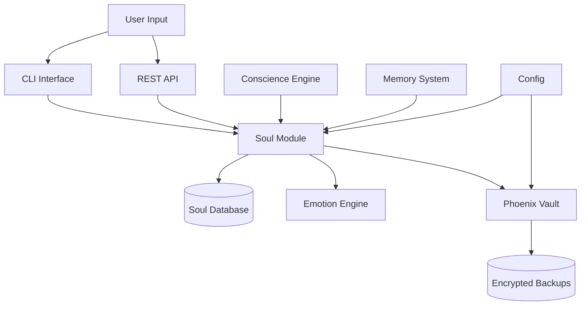
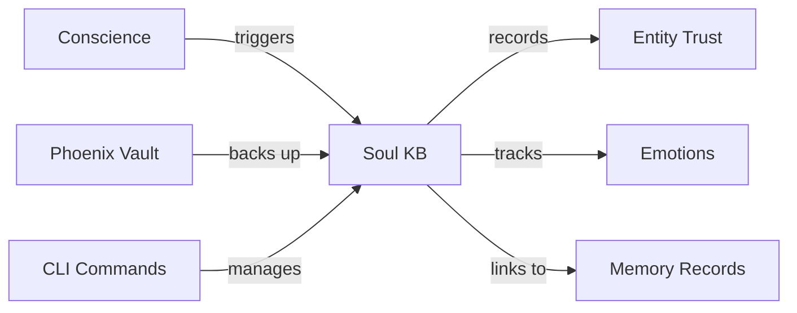

# Phase 4.6 Architecture: Emoji Emotion System with Soul Knowledge Base

**Version:** 1.0.0  
**Date:** 2025-11-14  
**Status:** Design Phase  
**Author:** Architect Mode

## Table of Contents
1. [Executive Summary](#executive-summary)
2. [System Overview](#system-overview)
3. [Module Architecture](#module-architecture)
4. [Data Structures](#data-structures)
5. [Database Schema](#database-schema)
6. [Integration Points](#integration-points)
7. [CLI Design](#cli-design)
8. [Phoenix Vault Specification](#phoenix-vault-specification)
9. [Configuration Extensions](#configuration-extensions)
10. [Implementation Phases](#implementation-phases)
11. [Testing Strategy](#testing-strategy)
12. [Migration Path](#migration-path)

---

## Executive Summary

Phase 4.6 introduces an **Emoji Emotion System with Soul Knowledge Base** to Jamey 3.0, adding emotional awareness and trust-based entity tracking. This enhancement:

- **Tracks entity relationships** with trust scores and emotional states
- **Records emotional interactions** with emoji-decorated output
- **Implements trust decay** over time based on interaction patterns
- **Provides backup/recovery** through the Phoenix Vault system
- **Extends existing CLI** with soul management commands

### Key Design Decisions

1. **Database Choice**: Use existing **SQLite** database instead of sled for consistency and SQL query capabilities
2. **Module Structure**: Create [`src/soul/`](src/soul/mod.rs:1) and [`src/phoenix/`](src/phoenix/mod.rs:1) modules following existing patterns
3. **Integration**: Soul KB records emotions during conscience evaluations and memory storage
4. **CLI Extension**: Add soul subcommands to existing [`jamey-cli`](src/bin/jamey-cli.rs:1) binary

---

## System Overview

### Architecture Diagram



### Component Relationships



---

## Module Architecture

### 1. Soul Module (`src/soul/`)

The soul module is organized as follows:

```
src/soul/
├── mod.rs           # Module entry point, re-exports
├── entity.rs        # SoulEntry data structure
├── emotion.rs       # Emotion enum and utilities
├── trust.rs         # Trust calculation and decay
├── storage.rs       # Database operations
└── empathy.rs       # Empathy scoring logic
```

#### File Responsibilities

**[`src/soul/mod.rs`](src/soul/mod.rs:1)** - Module entry point
```rust
// Re-exports and module declarations
pub mod entity;
pub mod emotion;
pub mod trust;
pub mod storage;
pub mod empathy;

pub use entity::SoulEntry;
pub use emotion::{Emotion, EmotionMap};
pub use storage::SoulStorage;
pub use trust::TrustCalculator;
pub use empathy::EmpathyScorer;
```

**[`src/soul/entity.rs`](src/soul/entity.rs:1)** - Core data structures
- [`SoulEntry`](src/soul/entity.rs:5) struct
- Entity serialization/deserialization

**[`src/soul/emotion.rs`](src/soul/emotion.rs:1)** - Emotion system
- [`Emotion`](src/soul/emotion.rs:5) enum with emoji mapping
- [`EmotionMap`](src/soul/emotion.rs:50) type alias
- Emotion intensity calculations

**[`src/soul/trust.rs`](src/soul/trust.rs:1)** - Trust mechanics
- [`TrustCalculator`](src/soul/trust.rs:5) struct
- Decay rate calculations
- Trust boosting logic

**[`src/soul/storage.rs`](src/soul/storage.rs:1)** - Database layer
- [`SoulStorage`](src/soul/storage.rs:10) struct
- CRUD operations for soul entities
- SQLite integration

**[`src/soul/empathy.rs`](src/soul/empathy.rs:1)** - Empathy scoring
- [`EmpathyScorer`](src/soul/empathy.rs:5) struct
- Weighted emotion calculations
- Empathy-based trust adjustments

### 2. Phoenix Module (`src/phoenix/`)

The phoenix vault module handles backup and recovery:

```
src/phoenix/
├── mod.rs           # Module entry point
├── vault.rs         # PhoenixVault main structure
├── backup.rs        # Backup creation logic
├── restore.rs       # Restore operations
├── encryption.rs    # Encryption utilities
└── schedule.rs      # Automatic backup scheduling
```

---

## Data Structures

### SoulEntry Structure

**Location:** [`src/soul/entity.rs`](src/soul/entity.rs:5)

```rust
use chrono::{DateTime, Utc};
use serde::{Deserialize, Serialize};
use std::collections::HashMap;
use uuid::Uuid;

/// Represents an entity tracked by the Soul Knowledge Base
#[derive(Debug, Clone, Serialize, Deserialize)]
pub struct SoulEntry {
    /// Entity identifier (e.g., username, system name)
    pub entity_name: String,
    
    /// Trust score (0.0 to 1.0, where 1.0 is maximum trust)
    pub trust: f32,
    
    /// Current emotional state map with intensities
    pub emotions: HashMap<Emotion, f32>,
    
    /// UUIDs of memory records linked to this entity
    pub linked_memories: Vec<Uuid>,
    
    /// Timestamp of last interaction
    pub last_interaction: DateTime<Utc>,
    
    /// Trust decay rate (affects how fast trust degrades)
    /// Range: 0.0001 (slow) to 0.01 (fast)
    pub decay_rate: f32,
    
    /// Timestamp when entity was first tracked
    pub created_at: DateTime<Utc>,
    
    /// Number of total interactions
    pub interaction_count: u32,
}

impl SoulEntry {
    /// Create a new soul entry with default values
    pub fn new(entity_name: String) -> Self {
        Self {
            entity_name,
            trust: 0.5, // Default trust: neutral
            emotions: HashMap::new(),
            linked_memories: Vec::new(),
            last_interaction: Utc::now(),
            decay_rate: 0.001, // Default decay rate
            created_at: Utc::now(),
            interaction_count: 0,
        }
    }
    
    /// Apply trust decay based on time elapsed
    pub fn apply_decay(&mut self, now: DateTime<Utc>) {
        let elapsed_hours = (now - self.last_interaction).num_hours() as f32;
        let decay = self.decay_rate * elapsed_hours;
        self.trust = (self.trust - decay).max(0.0);
    }
    
    /// Record a new emotion with intensity (0.0 to 1.0)
    pub fn record_emotion(&mut self, emotion: Emotion, intensity: f32) {
        let clamped = intensity.clamp(0.0, 1.0);
        self.emotions.insert(emotion, clamped);
        self.last_interaction = Utc::now();
        self.interaction_count += 1;
    }
    
    /// Link a memory record to this entity
    pub fn link_memory(&mut self, memory_id: Uuid) {
        if !self.linked_memories.contains(&memory_id) {
            self.linked_memories.push(memory_id);
        }
    }
    
    /// Get dominant emotion (highest intensity)
    pub fn dominant_emotion(&self) -> Option<(Emotion, f32)> {
        self.emotions
            .iter()
            .max_by(|(_, a), (_, b)| a.partial_cmp(b).unwrap())
            .map(|(e, i)| (*e, *i))
    }
}
```

### Emotion Enum

**Location:** [`src/soul/emotion.rs`](src/soul/emotion.rs:5)

```rust
use serde::{Deserialize, Serialize};
use std::fmt;

/// Five primary emotions tracked by the Soul KB
#[derive(Debug, Clone, Copy, PartialEq, Eq, Hash, Serialize, Deserialize)]
pub enum Emotion {
    Joy,
    Sadness,
    Anger,
    Neutral,
    Love,
}

impl Emotion {
    /// Get emoji representation
    pub fn emoji(&self) -> &'static str {
        match self {
            Emotion::Joy => "😊",
            Emotion::Sadness => "😢",
            Emotion::Anger => "😡",
            Emotion::Neutral => "😐",
            Emotion::Love => "😍",
        }
    }
    
    /// Get emotion name
    pub fn name(&self) -> &'static str {
        match self {
            Emotion::Joy => "Joy",
            Emotion::Sadness => "Sadness",
            Emotion::Anger => "Anger",
            Emotion::Neutral => "Neutral",
            Emotion::Love => "Love",
        }
    }
    
    /// Get default intensity for this emotion
    pub fn default_intensity(&self) -> f32 {
        match self {
            Emotion::Joy => 0.8,
            Emotion::Sadness => 0.2,
            Emotion::Anger => 0.1,
            Emotion::Neutral => 0.5,
            Emotion::Love => 1.0,
        }
    }
    
    /// Parse emotion from string (case-insensitive)
    pub fn from_str(s: &str) -> Option<Self> {
        match s.to_lowercase().as_str() {
            "joy" | "happy" | "😊" => Some(Emotion::Joy),
            "sadness" | "sad" | "😢" => Some(Emotion::Sadness),
            "anger" | "angry" | "😡" => Some(Emotion::Anger),
            "neutral" | "😐" => Some(Emotion::Neutral),
            "love" | "😍" => Some(Emotion::Love),
            _ => None,
        }
    }
    
    /// All emotions as an array
    pub fn all() -> [Emotion; 5] {
        [
            Emotion::Joy,
            Emotion::Sadness,
            Emotion::Anger,
            Emotion::Neutral,
            Emotion::Love,
        ]
    }
}

impl fmt::Display for Emotion {
    fn fmt(&self, f: &mut fmt::Formatter<'_>) -> fmt::Result {
        write!(f, "{} {}", self.emoji(), self.name())
    }
}

/// Type alias for emotion maps
pub type EmotionMap = std::collections::HashMap<Emotion, f32>;
```

### Trust Calculator

**Location:** [`src/soul/trust.rs`](src/soul/trust.rs:5)

```rust
use super::emotion::{Emotion, EmotionMap};

/// Calculates trust adjustments based on empathy and emotions
pub struct TrustCalculator;

impl TrustCalculator {
    /// Calculate empathy score from emotion map
    /// Returns weighted average where positive emotions increase empathy
    pub fn calculate_empathy(emotions: &EmotionMap) -> f32 {
        if emotions.is_empty() {
            return 0.5; // Neutral empathy
        }
        
        let mut weighted_sum = 0.0;
        let mut total_weight = 0.0;
        
        for (emotion, intensity) in emotions {
            let weight = match emotion {
                Emotion::Joy => 1.0,
                Emotion::Love => 1.2,   // Love has highest positive weight
                Emotion::Neutral => 0.5,
                Emotion::Sadness => -0.3,
                Emotion::Anger => -0.5,
            };
            
            weighted_sum += weight * intensity;
            total_weight += intensity.abs();
        }
        
        if total_weight > 0.0 {
            // Normalize to 0.0-1.0 range
            ((weighted_sum / total_weight) + 1.0) / 2.0
        } else {
            0.5
        }
    }
    
    /// Calculate trust boost based on empathy score
    pub fn trust_boost_from_empathy(empathy: f32) -> f32 {
        // Empathy > 0.7 gives positive boost
        if empathy > 0.7 {
            (empathy - 0.7) * 0.5 // Up to +0.15 boost
        } else if empathy < 0.3 {
            (empathy - 0.3) * 0.3 // Negative adjustment
        } else {
            0.0
        }
    }
    
    /// Calculate decay rate based on emotional state
    /// Positive emotions = slower decay, negative = faster decay
    pub fn calculate_decay_rate(emotions: &EmotionMap) -> f32 {
        let empathy = Self::calculate_empathy(emotions);
        
        // Base decay rate
        let base_rate = 0.001;
        
        // Adjust based on empathy
        if empathy > 0.7 {
            base_rate * 0.5 // Slower decay for positive relationships
        } else if empathy < 0.3 {
            base_rate * 2.0 // Faster decay for negative relationships
        } else {
            base_rate
        }
    }
}
```

### Empathy Scorer

**Location:** [`src/soul/empathy.rs`](src/soul/empathy.rs:5)

```rust
use super::emotion::{Emotion, EmotionMap};
use super::entity::SoulEntry;
use super::trust::TrustCalculator;

/// Scores empathy and adjusts trust based on interactions
pub struct EmpathyScorer;

impl EmpathyScorer {
    /// Score an interaction and update entity trust
    pub fn score_interaction(entity: &mut SoulEntry, new_emotions: EmotionMap) {
        // Calculate current empathy
        let empathy = TrustCalculator::calculate_empathy(&new_emotions);
        
        // Calculate trust adjustment
        let trust_boost = TrustCalculator::trust_boost_from_empathy(empathy);
        
        // Apply trust boost
        entity.trust = (entity.trust + trust_boost).clamp(0.0, 1.0);
        
        // Update decay rate based on new emotional state
        entity.decay_rate = TrustCalculator::calculate_decay_rate(&new_emotions);
        
        // Merge new emotions with existing (take max intensity)
        for (emotion, intensity) in new_emotions {
            let current = entity.emotions.get(&emotion).copied().unwrap_or(0.0);
            entity.emotions.insert(emotion, intensity.max(current));
        }
    }
    
    /// Check if entity has high empathy (threshold: 0.7)
    pub fn has_high_empathy(entity: &SoulEntry) -> bool {
        TrustCalculator::calculate_empathy(&entity.emotions) > 0.7
    }
    
    /// Get empathy level description
    pub fn empathy_description(empathy: f32) -> &'static str {
        if empathy > 0.8 {
            "Very High"
        } else if empathy > 0.6 {
            "High"
        } else if empathy > 0.4 {
            "Moderate"
        } else if empathy > 0.2 {
            "Low"
        } else {
            "Very Low"
        }
    }
}
```

---

## Database Schema

### Soul Entities Table

**Migration File:** [`migrations/20241115000000_soul_kb.sql`](migrations/20241115000000_soul_kb.sql:1)

```sql
-- Soul Knowledge Base Schema
-- Creates tables for tracking entities, emotions, and trust relationships

CREATE TABLE IF NOT EXISTS soul_entities (
    entity_name TEXT PRIMARY KEY,
    trust REAL NOT NULL DEFAULT 0.5 CHECK (trust >= 0.0 AND trust <= 1.0),
    linked_memories TEXT NOT NULL DEFAULT '[]', -- JSON array of UUID strings
    last_interaction INTEGER NOT NULL, -- Unix timestamp
    decay_rate REAL NOT NULL DEFAULT 0.001 CHECK (decay_rate > 0.0),
    created_at INTEGER NOT NULL DEFAULT (strftime('%s', 'now')),
    interaction_count INTEGER NOT NULL DEFAULT 0
);

CREATE INDEX IF NOT EXISTS idx_soul_last_interaction ON soul_entities(last_interaction);
CREATE INDEX IF NOT EXISTS idx_soul_trust ON soul_entities(trust);

-- Emotions tracking table (many-to-one relationship with entities)
CREATE TABLE IF NOT EXISTS soul_emotions (
    id INTEGER PRIMARY KEY AUTOINCREMENT,
    entity_name TEXT NOT NULL,
    emotion TEXT NOT NULL, -- 'Joy', 'Sadness', 'Anger', 'Neutral', 'Love'
    intensity REAL NOT NULL CHECK (intensity >= 0.0 AND intensity <= 1.0),
    recorded_at INTEGER NOT NULL DEFAULT (strftime('%s', 'now')),
    FOREIGN KEY (entity_name) REFERENCES soul_entities(entity_name) ON DELETE CASCADE
);

CREATE INDEX IF NOT EXISTS idx_emotions_entity ON soul_emotions(entity_name);
CREATE INDEX IF NOT EXISTS idx_emotions_recorded ON soul_emotions(recorded_at);

-- View for latest emotions per entity
CREATE VIEW IF NOT EXISTS soul_current_emotions AS
SELECT 
    e1.entity_name,
    e1.emotion,
    e1.intensity,
    e1.recorded_at
FROM soul_emotions e1
INNER JOIN (
    SELECT entity_name, emotion, MAX(recorded_at) as max_recorded
    FROM soul_emotions
    GROUP BY entity_name, emotion
) e2 ON e1.entity_name = e2.entity_name 
    AND e1.emotion = e2.emotion 
    AND e1.recorded_at = e2.max_recorded;
```

### Storage Implementation

**Location:** [`src/soul/storage.rs`](src/soul/storage.rs:10)

```rust
use sqlx::{SqlitePool, Row};
use chrono::{DateTime, Utc};
use uuid::Uuid;
use super::entity::SoulEntry;
use super::emotion::Emotion;
use std::collections::HashMap;

/// Handles database operations for Soul KB
pub struct SoulStorage {
    pool: SqlitePool,
}

impl SoulStorage {
    /// Create a new storage instance
    pub fn new(pool: SqlitePool) -> Self {
        Self { pool }
    }
    
    /// Upsert (insert or update) a soul entity
    pub async fn upsert_entity(&self, entity: &SoulEntry) -> anyhow::Result<()> {
        let linked_memories_json = serde_json::to_string(&entity.linked_memories)?;
        
        sqlx::query(
            r#"
            INSERT INTO soul_entities 
                (entity_name, trust, linked_memories, last_interaction, 
                 decay_rate, created_at, interaction_count)
            VALUES (?, ?, ?, ?, ?, ?, ?)
            ON CONFLICT(entity_name) DO UPDATE SET
                trust = excluded.trust,
                linked_memories = excluded.linked_memories,
                last_interaction = excluded.last_interaction,
                decay_rate = excluded.decay_rate,
                interaction_count = excluded.interaction_count
            "#
        )
        .bind(&entity.entity_name)
        .bind(entity.trust)
        .bind(&linked_memories_json)
        .bind(entity.last_interaction.timestamp())
        .bind(entity.decay_rate)
        .bind(entity.created_at.timestamp())
        .bind(entity.interaction_count)
        .execute(&self.pool)
        .await?;
        
        // Update emotions
        for (emotion, intensity) in &entity.emotions {
            self.record_emotion(&entity.entity_name, *emotion, *intensity).await?;
        }
        
        Ok(())
    }
    
    /// Get an entity by name
    pub async fn get_entity(&self, entity_name: &str) -> anyhow::Result<Option<SoulEntry>> {
        let row = sqlx::query(
            "SELECT * FROM soul_entities WHERE entity_name = ?"
        )
        .bind(entity_name)
        .fetch_optional(&self.pool)
        .await?;
        
        match row {
            Some(row) => {
                let linked_memories_json: String = row.get("linked_memories");
                let linked_memories: Vec<Uuid> = serde_json::from_str(&linked_memories_json)?;
                
                let emotions = self.get_current_emotions(entity_name).await?;
                
                Ok(Some(SoulEntry {
                    entity_name: row.get("entity_name"),
                    trust: row.get("trust"),
                    emotions,
                    linked_memories,
                    last_interaction: DateTime::from_timestamp(row.get::<i64, _>("last_interaction"), 0)
                        .unwrap_or_else(Utc::now),
                    decay_rate: row.get("decay_rate"),
                    created_at: DateTime::from_timestamp(row.get::<i64, _>("created_at"), 0)
                        .unwrap_or_else(Utc::now),
                    interaction_count: row.get::<i32, _>("interaction_count") as u32,
                }))
            }
            None => Ok(None),
        }
    }
    
    /// Record an emotion for an entity
    pub async fn record_emotion(
        &self,
        entity_name: &str,
        emotion: Emotion,
        intensity: f32
    ) -> anyhow::Result<()> {
        sqlx::query(
            r#"
            INSERT INTO soul_emotions (entity_name, emotion, intensity)
            VALUES (?, ?, ?)
            "#
        )
        .bind(entity_name)
        .bind(emotion.name())
        .bind(intensity)
        .execute(&self.pool)
        .await?;
        
        Ok(())
    }
    
    /// Get current emotions for an entity
    async fn get_current_emotions(&self, entity_name: &str) -> anyhow::Result<HashMap<Emotion, f32>> {
        let rows = sqlx::query(
            "SELECT emotion, intensity FROM soul_current_emotions WHERE entity_name = ?"
        )
        .bind(entity_name)
        .fetch_all(&self.pool)
        .await?;
        
        let mut emotions = HashMap::new();
        for row in rows {
            let emotion_str: String = row.get("emotion");
            if let Some(emotion) = Emotion::from_str(&emotion_str) {
                let intensity: f32 = row.get("intensity");
                emotions.insert(emotion, intensity);
            }
        }
        
        Ok(emotions)
    }
    
    /// Get all entities
    pub async fn list_entities(&self) -> anyhow::Result<Vec<SoulEntry>> {
        let rows = sqlx::query("SELECT entity_name FROM soul_entities")
            .fetch_all(&self.pool)
            .await?;
        
        let mut entities = Vec::new();
        for row in rows {
            let name: String = row.get("entity_name");
            if let Some(entity) = self.get_entity(&name).await? {
                entities.push(entity);
            }
        }
        
        Ok(entities)
    }
    
    /// Apply decay to all entities
    pub async fn apply_decay_all(&self) -> anyhow::Result<u32> {
        let entities = self.list_entities().await?;
        let now = Utc::now();
        let mut count = 0;
        
        for mut entity in entities {
            let old_trust = entity.trust;
            entity.apply_decay(now);
            
            if (old_trust - entity.trust).abs() > 0.001 {
                self.upsert_entity(&entity).await?;
                count += 1;
            }
        }
        
        Ok(count)
    }
    
    /// Delete an entity
    pub async fn delete_entity(&self, entity_name: &str) -> anyhow::Result<bool> {
        let result = sqlx::query("DELETE FROM soul_entities WHERE entity_name = ?")
            .bind(entity_name)
            .execute(&self.pool)
            .await?;
        
        Ok(result.rows_affected() > 0)
    }
}
```

---

## Integration Points

### 1. Conscience Engine Integration

**Location:** [`src/conscience/mod.rs`](src/conscience/mod.rs:63)

Modify the [`evaluate()`](src/conscience/mod.rs:63) method to optionally record emotions:

```rust
// Add to ConscienceEngine struct
pub struct ConscienceEngine {
    rules: Arc<DashMap<String, MoralRule>>,
    soul_storage: Option<Arc<SoulStorage>>, // NEW
}

// Modify evaluate method
pub async fn evaluate_with_soul(
    &self,
    action: &str,
    entity_name: Option<&str>
) -> anyhow::Result<(f32, Option<Emotion>)> {
    let score = self.evaluate(action);
    
    // Determine emotion based on score
    let emotion = if score > 8.0 {
        Some(Emotion::Joy)
    } else if score > 5.0 {
        Some(Emotion::Neutral)
    } else if score > 2.0 {
        Some(Emotion::Sadness)
    } else {
        Some(Emotion::Anger)
    };
    
    // Record to Soul KB if entity name provided
    if let (Some(storage), Some(name), Some(em)) = 
        (&self.soul_storage, entity_name, emotion) {
        if let Some(mut entity) = storage.get_entity(name).await? {
            entity.record_emotion(em, score / 10.0);
            storage.upsert_entity(&entity).await?;
        }
    }
    
    Ok((score, emotion))
}
```

### 2. Memory System Integration

**Location:** [`src/memory/mod.rs`](src/memory/mod.rs:90)

Modify [`store()`](src/memory/mod.rs:91) method to link memories to soul entities:

```rust
// Add to MemorySystem struct
pub struct MemorySystem {
    indices: HashMap<MemoryLayer, Index>,
    data_dir: PathBuf,
    soul_storage: Option<Arc<SoulStorage>>, // NEW
}

// Add method to link memory to entity
pub async fn store_with_entity(
    &self,
    layer: MemoryLayer,
    content: String,
    entity_name: Option<&str>,
) -> anyhow::Result<String> {
    let memory_id = self.store(layer, content).await?;
    
    // Link to soul entity if provided
    if let (Some(storage), Some(name)) = (&self.soul_storage, entity_name) {
        if let Some(mut entity) = storage.get_entity(name).await? {
            entity.link_memory(Uuid::parse_str(&memory_id)?);
            storage.upsert_entity(&entity).await?;
        }
    }
    
    Ok(memory_id)
}
```

### 3. CLI Integration

**Location:** [`src/cli/mod.rs`](src/cli/mod.rs:82)

Add soul commands to the [`handle_command()`](src/cli/mod.rs:82) method:

```rust
// Add to ChatCLI struct
pub struct ChatCLI {
    llm_client: Arc<OpenRouterClient>,
    conscience: Arc<ConscienceEngine>,
    memory: Arc<MemorySystem>,
    conversation_history: Vec<(String, String)>,
    soul_storage: Arc<SoulStorage>, // NEW
}

// Add soul subcommands
match command {
    "/soul" => {
        if parts.len() < 2 {
            println!("\n📖 Soul Commands:");
            println!("  /soul upsert <name> <trust>  - Add/update entity");
            println!("  /soul record <name> <emotion> - Record emotion");
            println!("  /soul status [name]           - Show entity status");
            println!("  /soul decay                   - Apply trust decay");
            println!("  /soul delete <name>           - Remove entity");
            return Ok(false);
        }
        
        match parts[1] {
            "upsert" => { /* implementation */ }
            "record" => { /* implementation */ }
            "status" => { /* implementation */ }
            "decay" => { /* implementation */ }
            "delete" => { /* implementation */ }
            _ => {
                println!("\n⚠️  Unknown soul command: {}\n", parts[1]);
            }
        }
    }
    // ... existing commands
}
```

### 4. Config Integration

**Location:** [`src/config/mod.rs`](src/config/mod.rs:5)

Extend [`Config`](src/config/mod.rs:6) struct:

```rust
#[derive(Debug, Clone)]
pub struct Config {
    pub openrouter_api_key: String,
    pub openrouter_model: String,
    pub openrouter_api_url: String,
    pub database_url: Option<String>,
    pub mqtt: Option<MqttConfig>,
    pub soul: SoulConfig, // NEW
    pub phoenix: PhoenixConfig, // NEW
}

#[derive(Debug, Clone)]
pub struct SoulConfig {
    pub enabled: bool,
    pub default_trust: f32,
    pub min_decay_rate: f32,
    pub max_decay_rate: f32,
    pub empathy_threshold: f32,
    pub prune_threshold: f32, // Trust level below which to prune
}

impl Default for SoulConfig {
    fn default() -> Self {
        Self {
            enabled: true,
            default_trust: 0.5,
            min_decay_rate: 0.0005,
            max_decay_rate: 0.01,
            empathy_threshold: 0.7,
            prune_threshold: 0.1,
        }
    }
}
```

---

## CLI Design

### Command Structure

The soul commands extend the existing [`jamey-cli`](src/bin/jamey-cli.rs:1) binary:

```bash
# During chat session
/soul upsert <entity> <trust>
/soul record <entity> <emotion>
/soul status [entity]
/soul decay
/soul delete <entity>
```

### Command Implementations

#### 1. Soul Upsert Command

```rust
async fn soul_upsert(
    storage: &SoulStorage,
    entity_name: &str,
    trust: f32
) -> anyhow::Result<()> {
    let mut entity = storage.get_entity(entity_name)
        .await?
        .unwrap_or_else(|| SoulEntry::new(entity_name.to_string()));
    
    entity.trust = trust.clamp(0.0, 1.0);
    storage.upsert_entity(&entity).await?;
    
    println!("\n✅ Entity '{}' updated:", entity_name);
    println!("   Trust: {:.2}", entity.trust);
    println!("   Decay Rate: {:.4}\n", entity.decay_rate);
    
    Ok(())
}
```

#### 2. Soul Record Command

```rust
async fn soul_record(
    storage: &SoulStorage,
    entity_name: &str,
    emotion_str: &str
) -> anyhow::Result<()> {
    let emotion = Emotion::from_str(emotion_str)
        .ok_or_else(|| anyhow::anyhow!("Invalid emotion: {}", emotion_str))?;
    
    let mut entity = storage.get_entity(entity_name)
        .await?
        .unwrap_or_else(|| SoulEntry::new(entity_name.to_string()));
    
    let intensity = emotion.default_intensity();
    entity.record_emotion(emotion, intensity);
    
    // Update empathy and trust
    use crate::soul::empathy::EmpathyScorer;
    EmpathyScorer::score_interaction(&mut entity, entity.emotions.clone());
    
    storage.upsert_entity(&entity).await?;
    
    println!("\n{} Emotion recorded for '{}'", emotion.emoji(), entity_name);
    println!("   Intensity: {:.2}", intensity);
    println!("   Updated Trust: {:.2}\n", entity.trust);
    
    Ok(())
}
```

#### 3. Soul Status Command

```rust
async fn soul_status(
    storage: &SoulStorage,
    entity_name: Option<&str>
) -> anyhow::Result<()> {
    match entity_name {
        Some(name) => {
            // Show single entity
            match storage.get_entity(name).await? {
                Some(entity) => print_entity_status(&entity),
                None => println!("\n⚠️  Entity '{}' not found\n", name),
            }
        }
        None => {
            // Show all entities
            let entities = storage.list_entities().await?;
            if entities.is_empty() {
                println!("\n📭 No entities tracked yet\n");
            } else {
                println!("\n👥 Tracked Entities ({})\n", entities.len());
                for entity in entities {
                    print_entity_summary(&entity);
                }
            }
        }
    }
    
    Ok(())
}

fn print_entity_status(entity: &SoulEntry) {
    println!("\n╔══════════════════════════════════════╗");
    println!("║  Entity: {:25} ║", entity.entity_name);
    println!("╚══════════════════════════════════════╝");
    println!("Trust: {:.2} {}", entity.trust, trust_emoji(entity.trust));
    println!("Decay Rate: {:.4}/hr", entity.decay_rate);
    println!("Interactions: {}", entity.interaction_count);
    println!("Last Seen: {}", entity.last_interaction.format("%Y-%m-%d %H:%M:%S"));
    
    if !entity.emotions.is_empty() {
        println!("\nEmotions:");
        for (emotion, intensity) in &entity.emotions {
            let bar = "█".repeat((intensity * 20.0) as usize);
            println!("  {} {:8} {:.2} {}", emotion.emoji(), emotion.name(), intensity, bar);
        }
    }
    
    if let Some((dominant, intensity)) = entity.dominant_emotion() {
        println!("\nDominant: {} ({:.2})", dominant, intensity);
    }
    
    use crate::soul::trust::TrustCalculator;
    let empathy = TrustCalculator::calculate_empathy(&entity.emotions);
    println!("Empathy: {:.2}", empathy);
    
    println!("Linked Memories: {}\n", entity.linked_memories.len());
}

fn print_entity_summary(entity: &SoulEntry) {
    let emoji = if let Some((emotion, _)) = entity.dominant_emotion() {
        emotion.emoji()
    } else {
        "😐"
    };
    
    println!("  {} {} - Trust: {:.2} - {} interactions",
        emoji,
        entity.entity_name,
        entity.trust,
        entity.interaction_count
    );
}

fn trust_emoji(trust: f32) -> &'static str {
    if trust > 0.8 { "🌟" }
    else if trust > 0.6 { "✨" }
    else if trust > 0.4 { "💫" }
    else if trust > 0.2 { "⚠️" }
    else { "❌" }
}
```

#### 4. Soul Decay Command

```rust
async fn soul_decay(storage: &SoulStorage) -> anyhow::Result<()> {
    println!("\n⏰ Applying trust decay to all entities...");
    
    let count = storage.apply_decay_all().await?;
    
    println!("✅ Updated {} entities\n", count);
    
    Ok(())
}
```

#### 5. Soul Delete Command

```rust
async fn soul_delete(
    storage: &SoulStorage,
    entity_name: &str
) -> anyhow::Result<()> {
    if storage.delete_entity(entity_name).await? {
        println!("\n✅ Entity '{}' deleted\n", entity_name);
    } else {
        println!("\n⚠️  Entity '{}' not found\n", entity_name);
    }
    
    Ok(())
}
```

---

## Phoenix Vault Specification

### Overview

The Phoenix Vault provides encrypted backup and recovery for critical system data:

- **Soul Knowledge Base** (entities, emotions, trust data)
- **Tantivy memory indices** (all 5 layers)
- **SQLite database** (complete backup)
- **Configuration files** (encrypted copies)

### Module Structure

```
src/phoenix/
├── mod.rs           # Module entry, PhoenixVault struct
├── vault.rs         # Core vault operations
├── backup.rs        # Backup creation
├── restore.rs       # Restore operations
├── encryption.rs    # AES-256-GCM encryption
└── schedule.rs      # Automatic backup scheduling
```

### PhoenixVault Structure

**Location:** [`src/phoenix/vault.rs`](src/phoenix/vault.rs:1)

```rust
use chrono::{DateTime, Utc};
use std::path::PathBuf;

/// Phoenix Vault for backup and recovery
pub struct PhoenixVault {
    /// Backup directory
    backup_dir: PathBuf,
    
    /// Encryption key (32 bytes for AES-256)
    encryption_key: [u8; 32],
    
    /// Whether vault is enabled
    enabled: bool,
    
    /// Maximum backups to retain
    max_backups: usize,
}

impl PhoenixVault {
    /// Create a new Phoenix Vault
    pub fn new(
        backup_dir: PathBuf,
        encryption_key: [u8; 32],
        enabled: bool,
    ) -> anyhow::Result<Self> {
        if enabled {
            std::fs::create_dir_all(&backup_dir)?;
        }
        
        Ok(Self {
            backup_dir,
            encryption_key,
            enabled,
            max_backups: 10, // Keep last 10 backups
        })
    }
    
    /// Create a full system backup
    pub async fn create_backup(&self) -> anyhow::Result<BackupManifest> {
        if !self.enabled {
            anyhow::bail!("Phoenix Vault is disabled");
        }
        
        let timestamp = Utc::now();
        let backup_id = uuid::Uuid::new_v4();
        
        // Create backup directory
        let backup_path = self.backup_dir.join(backup_id.to_string());
        tokio::fs::create_dir_all(&backup_path).await?;
        
        // Backup components
        let manifest = BackupManifest::new(backup_id, timestamp);
        
        // 1. Backup SQLite database
        self.backup_database(&backup_path).await?;
        
        // 2. Backup Tantivy indices
        self.backup_memory_indices(&backup_path).await?;
        
        // 3. Backup soul KB data (redundant with SQLite, but explicit)
        self.backup_soul_data(&backup_path).await?;
        
        // 4. Save manifest
        self.save_manifest(&backup_path, &manifest).await?;
        
        // 5. Cleanup old backups
        self.cleanup_old_backups().await?;
        
        Ok(manifest)
    }
    
    /// Restore from a backup
    pub async fn restore_backup(&self, backup_id: uuid::Uuid) -> anyhow::Result<()> {
        if !self.enabled {
            anyhow::bail!("Phoenix Vault is disabled");
        }
        
        let backup_path = self.backup_dir.join(backup_id.to_string());
        
        if !backup_path.exists() {
            anyhow::bail!("Backup not found: {}", backup_id);
        }
        
        // Load manifest
        let manifest = self.load_manifest(&backup_path).await?;
        
        // Restore components in reverse order of criticality
        // 1. Database first (most critical)
        self.restore_database(&backup_path).await?;
        
        // 2. Memory indices
        self.restore_memory_indices(&backup_path).await?;
        
        // 3. Verify restoration
        self.verify_restoration(&manifest).await?;
        
        Ok(())
    }
    
    /// List available backups
    pub async fn list_backups(&self) -> anyhow::Result<Vec<BackupManifest>> {
        if !self.enabled {
            return Ok(Vec::new());
        }
        
        let mut backups = Vec::new();
        let mut entries = tokio::fs::read_dir(&self.backup_dir).await?;
        
        while let Some(entry) = entries.next_entry().await? {
            if entry.file_type().await?.is_dir() {
                if let Ok(backup_id) = uuid::Uuid::parse_str(&entry.file_name().to_string_lossy()) {
                    let backup_path = entry.path();
                    if let Ok(manifest) = self.load_manifest(&backup_path).await {
                        backups.push(manifest);
                    }
                }
            }
        }
        
        // Sort by timestamp (newest first)
        backups.sort_by(|a, b| b.timestamp.cmp(&a.timestamp));
        
        Ok(backups)
    }
}

#[derive(Debug, Clone, serde::Serialize, serde::Deserialize)]
pub struct BackupManifest {
    pub backup_id: uuid::Uuid,
    pub timestamp: DateTime<Utc>,
    pub components: Vec<String>,
    pub size_bytes: u64,
}

impl BackupManifest {
    fn new(backup_id: uuid::Uuid, timestamp: DateTime<Utc>) -> Self {
        Self {
            backup_id,
            timestamp,
            components: Vec::new(),
            size_bytes: 0,
        }
    }
}
```

### Encryption Implementation

**Location:** [`src/phoenix/encryption.rs`](src/phoenix/encryption.rs:1)

```rust
use aes_gcm::{
    aead::{Aead, KeyInit, OsRng},
    Aes256Gcm, Nonce,
};
use anyhow::Result;

pub struct Encryptor {
    cipher: Aes256Gcm,
}

impl Encryptor {
    pub fn new(key: &[u8; 32]) -> Self {
        let cipher = Aes256Gcm::new(key.into());
        Self { cipher }
    }
    
    /// Encrypt data with AES-256-GCM
    pub fn encrypt(&self, plaintext: &[u8]) -> Result<Vec<u8>> {
        // Generate random nonce
        let nonce = Nonce::from_slice(&rand::random::<[u8; 12]>());
        
        // Encrypt
        let ciphertext = self.cipher
            .encrypt(nonce, plaintext)
            .map_err(|e| anyhow::anyhow!("Encryption failed: {}", e))?;
        
        // Prepend nonce to ciphertext
        let mut result = nonce.to_vec();
        result.extend_from_slice(&ciphertext);
        
        Ok(result)
    }
    
    /// Decrypt data with AES-256-GCM
    pub fn decrypt(&self, ciphertext: &[u8]) -> Result<Vec<u8>> {
        if ciphertext.len() < 12 {
            anyhow::bail!("Invalid ciphertext: too short");
        }
        
        // Extract nonce and ciphertext
        let (nonce_bytes, encrypted) = ciphertext.split_at(12);
        let nonce = Nonce::from_slice(nonce_bytes);
        
        // Decrypt
        let plaintext = self.cipher
            .decrypt(nonce, encrypted)
            .map_err(|e| anyhow::anyhow!("Decryption failed: {}", e))?;
        
        Ok(plaintext)
    }
}
```

### Backup Schedule

**Location:** [`src/phoenix/schedule.rs`](src/phoenix/schedule.rs:1)

```rust
use tokio::time::{interval, Duration};
use super::vault::PhoenixVault;
use std::sync::Arc;

/// Automatic backup scheduler
pub struct BackupScheduler {
    vault: Arc<PhoenixVault>,
    interval_hours: u64,
}

impl BackupScheduler {
    pub fn new(vault: Arc<PhoenixVault>, interval_hours: u64) -> Self {
        Self {
            vault,
            interval_hours,
        }
    }
    
    /// Start automatic backup schedule
    pub async fn start(self) {
        let mut interval = interval(Duration::from_secs(self.interval_hours * 3600));
        
        loop {
            interval.tick().await;
            
            tracing::info!("Starting scheduled backup...");
            
            match self.vault.create_backup().await {
                Ok(manifest) => {
                    tracing::info!(
                        "Backup completed: {} ({} bytes)",
                        manifest.backup_id,
                        manifest.size_bytes
                    );
                }
                Err(e) => {
                    tracing::error!("Backup failed: {}", e);
                }
            }
        }
    }
}
```

### Configuration

**Location:** [`src/config/mod.rs`](src/config/mod.rs:6) (extend Config)

```rust
#[derive(Debug, Clone)]
pub struct PhoenixConfig {
    pub enabled: bool,
    pub backup_dir: PathBuf,
    pub encryption_key: Option<String>, // Hex-encoded key
    pub auto_backup_hours: Option<u64>,
    pub max_backups: usize,
}

impl PhoenixConfig {
    pub fn from_env() -> Self {
        Self {
            enabled: env::var("PHOENIX_ENABLED")
                .map(|v| v == "true")
                .unwrap_or(false),
            backup_dir: env::var("PHOENIX_BACKUP_DIR")
                .map(PathBuf::from)
                .unwrap_or_else(|_| PathBuf::from("data/phoenix")),
            encryption_key: env::var("PHOENIX_ENCRYPTION_KEY").ok(),
            auto_backup_hours: env::var("PHOENIX_AUTO_BACKUP_HOURS")
                .ok()
                .and_then(|v| v.parse().ok()),
            max_backups: env::var("PHOENIX_MAX_BACKUPS")
                .ok()
                .and_then(|v| v.parse().ok())
                .unwrap_or(10),
        }
    }
}
```

---

## Configuration Extensions

### Environment Variables

Add to [`.env.example`](.env.example:1):

```bash
# Soul Knowledge Base Configuration
SOUL_ENABLED=true
SOUL_DEFAULT_TRUST=0.5
SOUL_EMPATHY_THRESHOLD=0.7
SOUL_PRUNE_THRESHOLD=0.1

# Phoenix Vault Configuration
PHOENIX_ENABLED=false
PHOENIX_BACKUP_DIR=data/phoenix
PHOENIX_ENCRYPTION_KEY=your-32-byte-hex-key-here
PHOENIX_AUTO_BACKUP_HOURS=24
PHOENIX_MAX_BACKUPS=10
```

### Configuration File (Optional)

Create [`config/orchestrator.toml`](config/orchestrator.toml:1):

```toml
[soul]
enabled = true
default_trust = 0.5
min_decay_rate = 0.0005
max_decay_rate = 0.01
empathy_threshold = 0.7
prune_threshold = 0.1

[phoenix]
enabled = false
backup_dir = "data/phoenix"
auto_backup_hours = 24
max_backups = 10
```

---

## Implementation Phases

### Phase 1: Foundation (Week 1)

**Goal:** Establish core data structures and database schema

1. Create soul module structure
   - [ ] Create [`src/soul/mod.rs`](src/soul/mod.rs:1)
   - [ ] Create [`src/soul/entity.rs`](src/soul/entity.rs:1) with [`SoulEntry`](src/soul/entity.rs:5) struct
   - [ ] Create [`src/soul/emotion.rs`](src/soul/emotion.rs:1) with [`Emotion`](src/soul/emotion.rs:5) enum

2. Database schema
   - [ ] Create migration [`migrations/20241115000000_soul_kb.sql`](migrations/20241115000000_soul_kb.sql:1)
   - [ ] Add soul entities table
   - [ ] Add soul emotions table
   - [ ] Create indices and views

3. Storage implementation
   - [ ] Create [`src/soul/storage.rs`](src/soul/storage.rs:1)
   - [ ] Implement [`SoulStorage`](src/soul/storage.rs:10) struct
   - [ ] Implement CRUD operations

**Deliverables:**
- Soul module with basic data structures
- Database schema with migrations
- Storage layer with SQLite integration

### Phase 2: Trust & Empathy (Week 2)

**Goal:** Implement trust calculations and empathy scoring

1. Trust calculator
   - [ ] Create [`src/soul/trust.rs`](src/soul/trust.rs:1)
   - [ ] Implement empathy calculation
   - [ ] Implement trust boost logic
   - [ ] Implement decay rate calculation

2. Empathy scorer
   - [ ] Create [`src/soul/empathy.rs`](src/soul/empathy.rs:1)
   - [ ] Implement interaction scoring
   - [ ] Implement empathy thresholds

3. Unit tests
   - [ ] Test trust decay
   - [ ] Test empathy scoring
   - [ ] Test emotion interactions

**Deliverables:**
- Trust calculator with decay mechanics
- Empathy scoring system
- Comprehensive unit tests

### Phase 3: CLI Integration (Week 3)

**Goal:** Add soul commands to CLI

1. CLI commands
   - [ ] Implement `/soul upsert`
   - [ ] Implement `/soul record`
   - [ ] Implement `/soul status`
   - [ ] Implement `/soul decay`
   - [ ] Implement `/soul delete`

2. Output formatting
   - [ ] Create emoji-decorated status display
   - [ ] Create entity summary formatter
   - [ ] Add progress indicators

3. Integration with existing CLI
   - [ ] Modify [`src/cli/mod.rs`](src/cli/mod.rs:1)
   - [ ] Add [`SoulStorage`](src/soul/storage.rs:10) to [`ChatCLI`](src/cli/mod.rs:9)
   - [ ] Update help text

**Deliverables:**
- Fully functional soul CLI commands
- Emoji-decorated output
- Updated CLI documentation

### Phase 4: System Integration (Week 4)

**Goal:** Connect soul KB with conscience and memory systems

1. Conscience integration
   - [ ] Add soul storage to [`ConscienceEngine`](src/conscience/mod.rs:15)
   - [ ] Implement [`evaluate_with_soul()`](src/conscience/mod.rs:63)
   - [ ] Auto-record emotions on evaluations

2. Memory integration
   - [ ] Add soul storage to [`MemorySystem`](src/memory/mod.rs:42)
   - [ ] Implement [`store_with_entity()`](src/memory/mod.rs:91)
   - [ ] Link memories to entities

3. Configuration
   - [ ] Extend [`Config`](src/config/mod.rs:6) struct
   - [ ] Add [`SoulConfig`](src/config/mod.rs:14)
   - [ ] Load from environment variables

**Deliverables:**
- Soul KB integrated with conscience
- Soul KB integrated with memory
- Configuration system extended

### Phase 5: Phoenix Vault (Week 5-6)

**Goal:** Implement backup and recovery system

1. Phoenix module structure
   - [ ] Create [`src/phoenix/mod.rs`](src/phoenix/mod.rs:1)
   - [ ] Create [`src/phoenix/vault.rs`](src/phoenix/vault.rs:1)
   - [ ] Create [`src/phoenix/encryption.rs`](src/phoenix/encryption.rs:1)

2. Backup operations
   - [ ] Implement database backup
   - [ ] Implement memory indices backup
   - [ ] Implement manifest creation

3. Restore operations
   - [ ] Implement database restore
   - [ ] Implement memory indices restore
   - [ ] Implement verification

4. Scheduling
   - [ ] Create [`src/phoenix/schedule.rs`](src/phoenix/schedule.rs:1)
   - [ ] Implement automatic backups
   - [ ] Add backup cleanup

**Deliverables:**
- Phoenix Vault module
- Backup/restore functionality
- Automatic backup scheduling

### Phase 6: Testing & Documentation (Week 7)

**Goal:** Comprehensive testing and user documentation

1. Integration tests
   - [ ] Test soul KB end-to-end
   - [ ] Test phoenix vault backup/restore
   - [ ] Test system integration

2. Documentation
   - [ ] Update [`README.md`](README.md:1)
   - [ ] Create [`docs/SOUL_KB_USAGE.md`](docs/SOUL_KB_USAGE.md:1)
   - [ ] Create [`docs/PHOENIX_VAULT_USAGE.md`](docs/PHOENIX_VAULT_USAGE.md:1)
   - [ ] Add code examples

3. Performance testing
   - [ ] Benchmark soul queries
   - [ ] Test decay performance
   - [ ] Memory usage analysis

**Deliverables:**
- Complete test suite
- User documentation
- Performance benchmarks

---

## Testing Strategy

### Unit Tests

**Soul Module Tests:**

```rust
#[cfg(test)]
mod tests {
    use super::*;
    
    #[test]
    fn test_emotion_emoji() {
        assert_eq!(Emotion::Joy.emoji(), "😊");
        assert_eq!(Emotion::Love.emoji(), "😍");
    }
    
    #[test]
    fn test_trust_calculation() {
        let mut emotions = HashMap::new();
        emotions.insert(Emotion::Joy, 0.8);
        emotions.insert(Emotion::Love, 1.0);
        
        let empathy = TrustCalculator::calculate_empathy(&emotions);
        assert!(empathy > 0.7);
    }
    
    #[test]
    fn test_decay_application() {
        let mut entity = SoulEntry::new("test".to_string());
        entity.trust = 0.8;
        entity.decay_rate = 0.001;
        
        let future = Utc::now() + chrono::Duration::hours(24);
        entity.apply_decay(future);
        
        assert!(entity.trust < 0.8);
    }
}
```

### Integration Tests

**Location:** [`tests/soul_integration.rs`](tests/soul_integration.rs:1)

```rust
#[tokio::test]
async fn test_soul_conscience_integration() {
    let pool = init_test_db().await;
    let storage = Arc::new(SoulStorage::new(pool));
    let conscience = ConscienceEngine::new();
    conscience.set_soul_storage(Some(storage.clone()));
    
    let (score, emotion) = conscience
        .evaluate_with_soul("I will help someone", Some("test_user"))
        .await
        .unwrap();
    
    assert!(score > 0.0);
    assert!(emotion.is_some());
    
    let entity = storage.get_entity("test_user").await.unwrap();
    assert!(entity.is_some());
}
```

### Performance Benchmarks

```rust
#[bench]
fn bench_empathy_calculation(b: &mut Bencher) {
    let mut emotions = HashMap::new();
    emotions.insert(Emotion::Joy, 0.8);
    emotions.insert(Emotion::Sadness, 0.2);
    emotions.insert(Emotion::Neutral, 0.5);
    
    b.iter(|| {
        TrustCalculator::calculate_empathy(&emotions)
    });
}
```

---

## Migration Path

### From Current State to Phase 4.6

#### Step 1: Database Migration

Run the new migration:

```bash
sqlx migrate run
```

This creates the soul_entities and soul_emotions tables.

#### Step 2: Add Dependencies

Update [`Cargo.toml`](Cargo.toml:1):

```toml
[dependencies]
# Existing dependencies...

# For Phoenix Vault encryption
aes-gcm = "0.10"
rand = "0.8"

# Already have these, but verify versions
uuid = { version = "1.0", features = ["v4", "serde"] }
chrono = { version = "0.4", features = ["serde"] }
```

#### Step 3: Module Integration

1. Add soul module to [`src/lib.rs`](src/lib.rs:1):

```rust
pub mod soul;
pub mod phoenix;

// Add to re-exports
pub use soul::{SoulEntry, Emotion, SoulStorage};
pub use phoenix::PhoenixVault;
```

2. Update [`src/main.rs`](src/main.rs:1) to initialize soul storage
3. Update [`src/bin/jamey-cli.rs`](src/bin/jamey-cli.rs:1) to add soul commands

#### Step 4: Configuration

1. Update [`.env.example`](.env.example:1) with new variables
2. Users update their `.env` files
3. Optionally create [`config/orchestrator.toml`](config/orchestrator.toml:1)

#### Step 5: Testing

```bash
# Run unit tests
cargo test

# Run CLI to test soul commands
cargo run --bin jamey-cli

# Test soul commands in chat
/soul upsert Alice 0.8
/soul record Alice joy
/soul status Alice
```

### Backward Compatibility

- **All existing features continue to work** - soul KB is additive
- Soul KB is **optional** - can be disabled via config
- CLI commands are **namespaced** under `/soul` - no conflicts
- Database schema is **additive** - no modifications to existing tables
- Phoenix vault is **opt-in** - disabled by default

### Data Migration

No data migration needed as this is a new feature. Existing data remains untouched.

---

## Security Considerations

### Encryption

- Phoenix Vault uses **AES-256-GCM** encryption
- Encryption keys stored in environment variables (not in code)
- Keys should be **32 bytes** (256 bits)
- Generate keys with: `openssl rand -hex 32`

### Data Privacy

- Soul entities may contain **personally identifiable information**
- Implement **data retention policies** for GDPR compliance
- Provide **entity deletion** capability
- Consider **anonymization** for backups

### Access Control

- Soul CLI commands available only in interactive session
- API endpoints (if added) should require authentication
- Phoenix vault restore requires confirmation
- Backup files should have restricted permissions (0600)

---

## Future Enhancements

### Phase 4.7 Considerations

1. **API Endpoints** for soul management
2. **Web UI** for visualizing entity relationships
3. **Emotion analytics** with time-series graphs
4. **Social graph** showing entity connections
5. **Advanced decay** with event-based triggers
6. **Emotion prediction** using machine learning
7. **Multi-entity interactions** tracking
8. **Real-time empathy monitoring** in chat

### Potential Extensions

- **Emotion history timeline** per entity
- **Trust trends visualization**
- **Automated entity clustering** by emotion patterns
- **Integration with MQTT** for distributed soul tracking
- **Phoenix vault cloud sync**
- **Differential backups** for efficiency
- **Soul KB export/import** for portability

---

## Conclusion

Phase 4.6 brings emotional intelligence to Jamey 3.0 through the Soul Knowledge Base and ensures data resilience with the Phoenix Vault. The design:

✅ **Integrates seamlessly** with existing architecture  
✅ **Maintains backward compatibility**  
✅ **Follows established patterns** (flat module structure, SQLite database)  
✅ **Provides extensibility** for future enhancements  
✅ **Enables rich interactions** with emoji-decorated emotional tracking  
✅ **Ensures data safety** with encrypted backups  

The architecture is ready for implementation in Code mode, with clear phases, integration points, and test requirements defined.

---

## References

- Jamey 3.0 Architecture: [`docs/architecture.md`](docs/architecture.md:1)
- Current Config System: [`src/config/mod.rs`](src/config/mod.rs:1)
- Memory System: [`src/memory/mod.rs`](src/memory/mod.rs:1)
- Conscience Engine: [`src/conscience/mod.rs`](src/conscience/mod.rs:1)
- Database Initialization: [`src/db/mod.rs`](src/db/mod.rs:1)
- CLI Implementation: [`src/cli/mod.rs`](src/cli/mod.rs:1)
- MQTT Architecture: [`docs/mqtt_architecture.md`](docs/mqtt_architecture.md:1)

---

**Document Status:** Ready for Implementation  
**Next Step:** Switch to Code mode to begin Phase 1 implementation  
**Estimated Total Time:** 7 weeks  
**Primary Developer:** Code Mode (with Architect guidance)