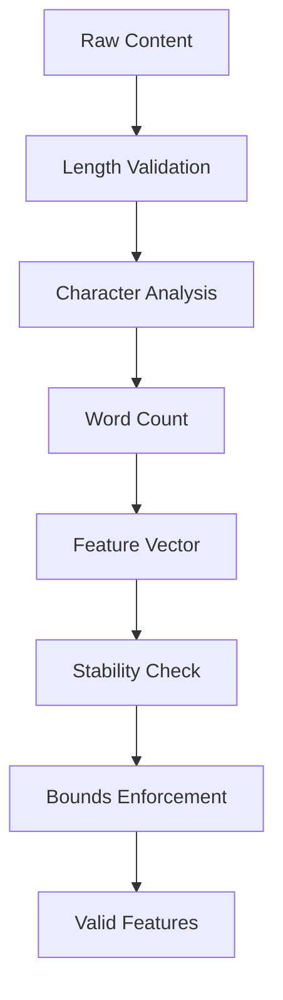

# Φ (Integrated Information) Calculation System Improvements

## 1. Numerical Stability Enhancements

### 1.1 Adaptive Epsilon Scaling
```rust
/// Adaptive epsilon calculation based on network properties
pub fn compute_adaptive_epsilon(network_size: usize, connectivity: &Array2<f64>) -> f64 {
    let base_epsilon = 1e-6;
    let connectivity_factor = connectivity.sum() / (network_size * network_size) as f64;
    let size_factor = (network_size as f64).log2().max(1.0);
    
    base_epsilon * connectivity_factor * size_factor
}
```

### 1.2 Multi-Stage Denominator Protection
- Primary Guard: Adaptive epsilon scaling
- Secondary Guard: Progressive thresholds based on activation levels
- Tertiary Guard: Fallback to minimum integration value

```rust
const MIN_INTEGRATION_VALUE: f64 = 1e-12;
const ACTIVATION_THRESHOLD_LOW: f64 = 0.1;
const ACTIVATION_THRESHOLD_HIGH: f64 = 0.9;

fn apply_denominator_protection(raw_integration: f64, max_integration: f64, epsilon: f64) -> f64 {
    if max_integration <= epsilon {
        MIN_INTEGRATION_VALUE
    } else if max_integration <= epsilon * 10.0 {
        epsilon
    } else {
        max_integration
    }
}
```

### 1.3 Feature Extraction Stability
- Add variance-based stability checks for feature extraction
- Implement bounds validation for extracted features
- Add recovery mechanisms for unstable features

```rust
struct FeatureStabilityCheck {
    variance_threshold: f64,
    min_sample_size: usize,
    recovery_default: f64,
}

impl FeatureStabilityCheck {
    fn validate_feature(values: &[f64]) -> Result<f64, StabilityError> {
        // Implementation details for feature validation
    }
}
```

## 2. Network State Management

### 2.1 Feature Extraction Validation Pipeline


### 2.2 Activation Bounds Enforcement
- Implement strict bounds checking for all activation values
- Add recovery mechanisms for out-of-bounds values
- Track activation history for anomaly detection

```rust
struct ActivationBounds {
    min_value: f64,
    max_value: f64,
    recovery_strategy: RecoveryStrategy,
}

enum RecoveryStrategy {
    Clamp,
    Reset,
    Interpolate,
}
```

### 2.3 Network State Consistency
- Validate network state invariants
- Check activation sum constraints
- Verify connectivity matrix properties

## 3. Performance Optimizations

### 3.1 Feature Vector Caching
```rust
use lru::LruCache;

struct FeatureCache {
    cache: LruCache<String, Vec<f64>>,
    max_size: usize,
    hit_count: AtomicUsize,
    miss_count: AtomicUsize,
}
```

### 3.2 Parallel Processing
- Implement parallel feature extraction
- Vectorize activation calculations
- Add concurrent state validation

```rust
use rayon::prelude::*;

impl PhiCalculator {
    fn parallel_feature_extraction(&self, content: &str) -> Vec<f64> {
        // Parallel implementation details
    }
}
```

### 3.3 Performance Monitoring
- Add timing metrics for key operations
- Track cache hit/miss rates
- Monitor memory usage patterns

```rust
metrics! {
    phi_calculation_duration_ms,
    feature_extraction_duration_ms,
    cache_hit_ratio,
    memory_usage_bytes,
}
```

## 4. Validation Criteria

### 4.1 Numerical Stability Tests
- Test with extreme input values
- Verify denominator protection
- Validate feature extraction stability

### 4.2 State Management Tests
- Verify activation bounds enforcement
- Test network state consistency
- Validate recovery mechanisms

### 4.3 Performance Tests
- Measure cache effectiveness
- Verify parallel processing speedup
- Monitor memory usage patterns

## 5. Implementation Guidelines

### 5.1 Code Structure
- Separate stability checks into dedicated module
- Implement trait-based validation system
- Use builder pattern for configuration

### 5.2 Error Handling
- Define custom error types for stability issues
- Implement recovery strategies
- Add detailed error logging

### 5.3 Configuration
- Make thresholds configurable
- Allow tuning of cache sizes
- Support custom validation rules

## 6. Migration Strategy

1. Implement numerical stability improvements
2. Add state management enhancements
3. Deploy performance optimizations
4. Enable monitoring and validation
5. Roll out in phases with feature flags