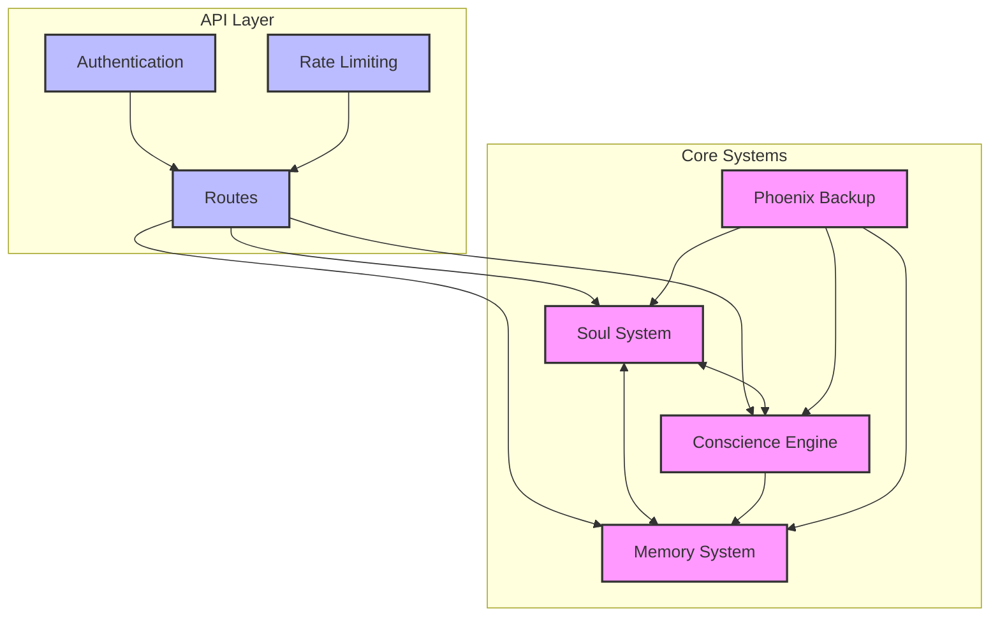
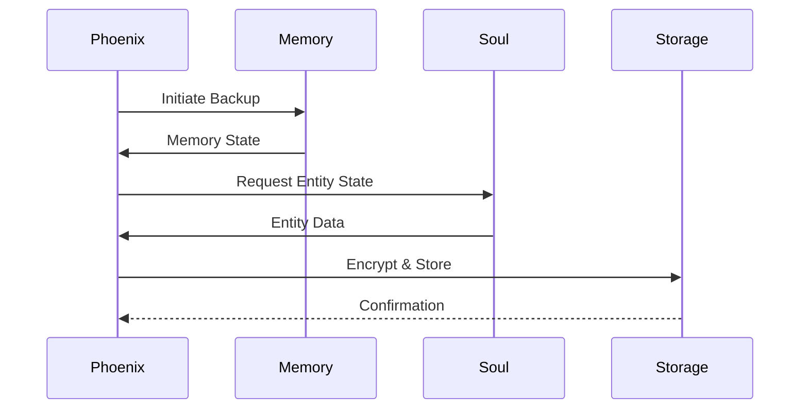

# System Interactions Overview

## System Component Diagram



## Component Responsibilities

### Core Systems
1. **Soul System**
   - Manages emotional states and trust relationships
   - Tracks entity relationships
   - Handles empathy scoring
   - Maintains trust calculations

2. **Conscience Engine**
   - Evaluates actions against moral rules
   - Processes weighted scoring
   - Integrates with Soul for emotional context
   - Manages moral rule definitions

3. **Memory System**
   - Handles multi-layered memory storage
   - Manages memory optimization
   - Provides caching mechanisms
   - Integrates with Soul for entity associations

4. **Phoenix Backup**
   - Provides encrypted backup/recovery
   - Manages scheduled backups
   - Handles secure data restoration
   - Protects system state

### API Layer
- Authentication and authorization
- Rate limiting and DDoS protection
- Request routing and validation
- Integration point management

## Key Integration Points

1. **API Integration Points**
   - `/evaluate` - Action evaluation endpoint
   - `/rules` - Moral rules management
   - `/consciousness/metrics` - System metrics
   - Health and monitoring endpoints

2. **Inter-System Communication**
   - Direct function calls between components
   - Shared state management
   - Event-based communication
   - Database-mediated interactions

## Data Flow Patterns

### Primary Data Paths
1. **Action Evaluation Flow**
   ```mermaid
   sequenceDiagram
       participant API
       participant Conscience
       participant Soul
       participant Memory

       API->>Conscience: Evaluate Action
       Conscience->>Soul: Get Entity Context
       Soul-->>Conscience: Entity State
       Conscience->>Memory: Store Result
       Memory-->>API: Confirmation
   ```

2. **Memory-Soul Integration**
   ```mermaid
   sequenceDiagram
       participant Memory
       participant Soul
       participant Phoenix

       Memory->>Soul: Store Entity Memory
       Soul->>Memory: Update Associations
       Memory->>Phoenix: Trigger Backup
       Phoenix-->>Memory: Backup Complete
   ```

## State Management

### Component States
1. **Soul System**
   - Entity emotional states
   - Trust relationships
   - Empathy scores

2. **Conscience Engine**
   - Moral rules
   - Evaluation weights
   - Action history

3. **Memory System**
   - Short-term cache
   - Long-term storage
   - Working memory state

4. **Phoenix Backup**
   - Backup manifests
   - Encryption states
   - Schedule tracking

### State Persistence
- SQLite database for structured data
- File-based storage for memory indices
- Encrypted backup archives
- Configuration state management

## Storage Interactions

### Database Operations
- Entity state persistence
- Memory record storage
- System metrics tracking
- Configuration management

### File System Operations
- Memory index management
- Backup file handling
- Configuration storage
- Log management

## Backup/Restore Flows

### Backup Process


### Restore Process
```mermaid
sequenceDiagram
    participant Phoenix
    participant Storage
    participant Memory
    participant Soul

    Phoenix->>Storage: Request Backup
    Storage->>Phoenix: Encrypted Data
    Phoenix->>Memory: Restore Memory State
    Phoenix->>Soul: Restore Entity State
    Memory-->>Phoenix: Restore Complete
    Soul-->>Phoenix: Restore Complete